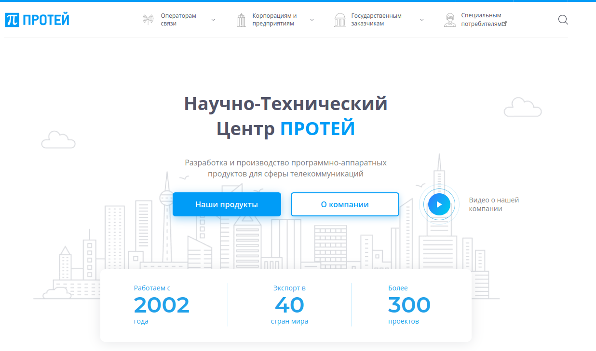
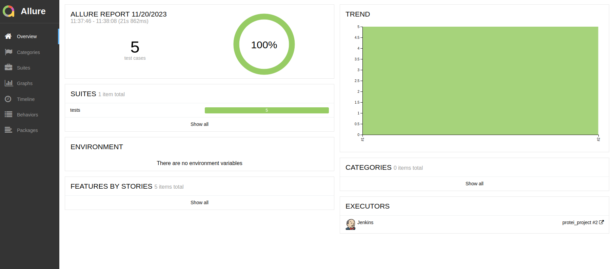
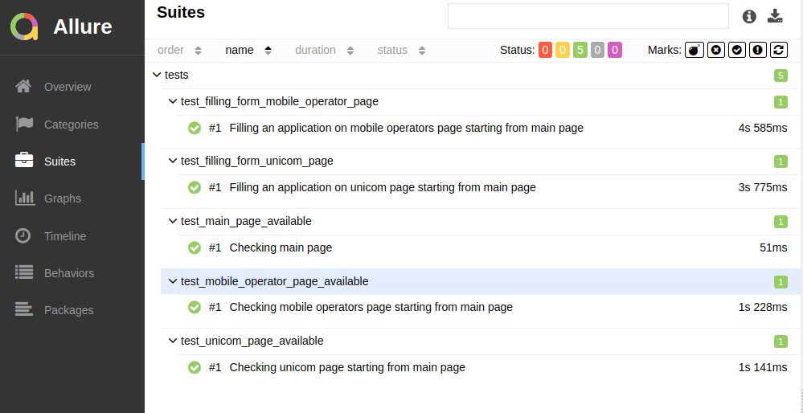
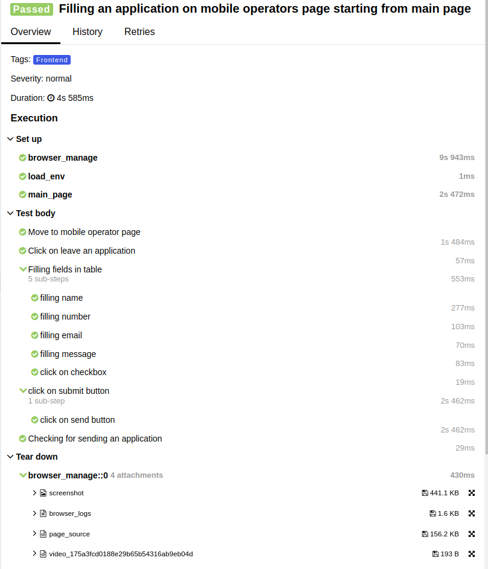
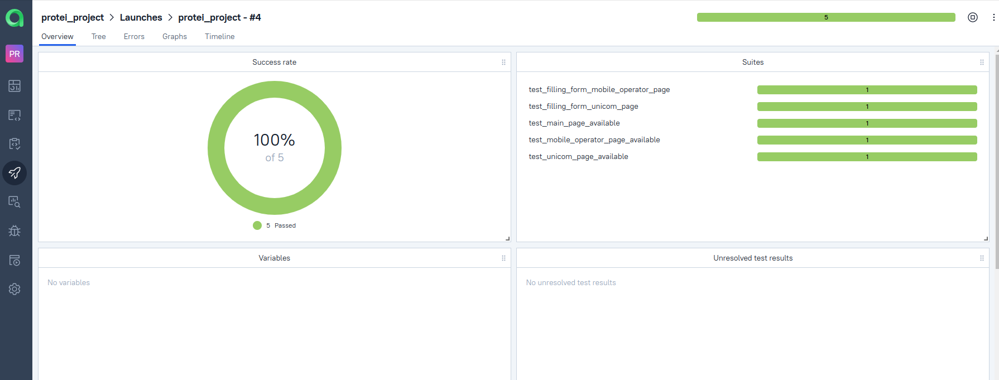
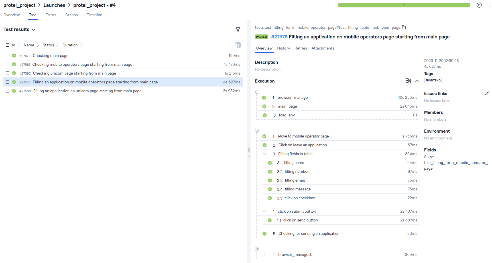
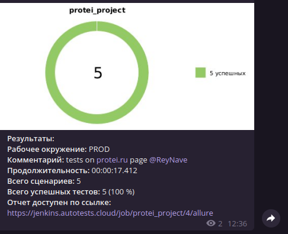
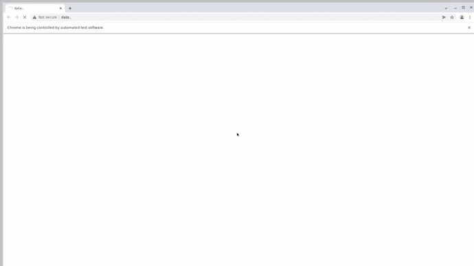

# Проект по тестированию сайта <a target="_blank" href="https://protei.ru/">"НТЦ Протей" </a> 



----

### Список проверок, реализованных в автотестах

- [x] Доступ к Главной странице
- [x] Переход с Главной к странице Мобильных операторов
- [x] Заполнение формы для заявки мобильных операторов
- [x] Переход с Главной к странице ПРОТЕЙ-Юником
- [x] Заполнение формы для заявки на корпоративный мессенджер

----
### Используемый стэк
       

----
### Локальный запуск автотестов

#### Выполнить в cli:
> [!NOTE]
> Ключ выбора версии `--browser-version` не обязателен
```bash
python -m venv .venv
source .venv/bin/activate
pip install -r requirements.txt
pytest . --browser-version=100
```
#### Получение отчёта:
```bash
allure serve tests/allure-results
```

----
### Проект в Jenkins
> <a target="_blank" href="https://jenkins.autotests.cloud/job/protei_project///">Ссылка</a>

#### Параметры сборки


* environment - параметр определяет окружение для запуска тестов
* browser version - параметр для настройки версии браузера для запуска тестов

#### Запуск автотестов в Jenkins
1. Открыть <a target="_blank" href="https://jenkins.autotests.cloud/job/protei_project">проект</a>
2. Нажать "Build with Parameters"
3. Из списка "ENVIRONMENT" выбрать: PROD
4. В поле "BROWSER_VERSION" ввести предпочитаемую версию браузера
5. Нажать "Build"

----
### Allure отчет
#### Общие результаты


#### Список тест кейсов

#### Отчет прохождения теста



----
### Интеграция с Allure TestOps
> <a target="_blank" href="https://allure.autotests.cloud/launch/32414">Ссылка на проект</a>

#### Информация с общими показателями тестовых прогонов



#### Дерево тест-кейсов



----
### Оповещения в Telegram



----
### Видео прохождения автотеста



----
